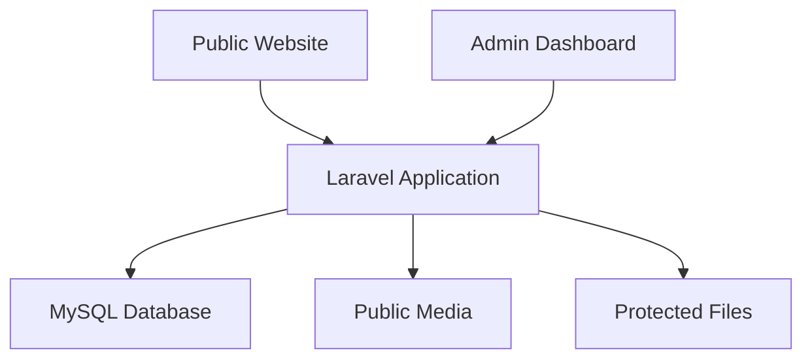
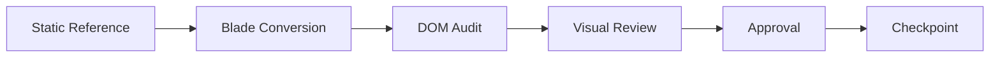

<div align="center">
  

  <h1>Smart Digital Solutions Powered by AI</h1>
  <p><strong>Technology • Automation • Procurement</strong></p>
  <p>One trusted partner for intelligent digital systems and dependable general supply.</p>

  <p>
    
    
    
    
  </p>

  <p>
    <a href="#-what-snipezon-provides">Services</a> •
    <a href="#-implementation-status">Progress</a> •
    <a href="#-local-development">Installation</a> •
    <a href="#-security-foundation">Security</a> •
    <a href="#-contact">Contact</a>
  </p>
</div>

---

Snipezon is a business solutions company providing custom software, AI-powered automation, modern websites, WhatsApp integrations, customer engagement systems, and requirement-based general item sourcing.

This repository contains the Laravel-based Snipezon website and its developing administration platform. The original static website is retained separately as a protected visual and content reference during the migration.

> [!IMPORTANT]
> **Current status:** The Laravel foundation, authentication, roles, Homepage, and About page are implemented. Remaining public pages and database-driven admin modules are being integrated progressively.

## ✦ What Snipezon Provides

| 💻 Digital Solutions | 📦 General Supply |
| --- | --- |
| Custom Software Development | Home Essentials |
| AI-Based Software Solutions | Corporate Items |
| WhatsApp Business API Setup | Industrial Items |
| Customer Care Automation | Toys |
| Sales Bots and AI Chatbots | Multi-category sourcing |
| Accounting Software | Requirement coordination |
| E-commerce Websites | Business procurement support |
| Static and Dynamic Websites | Reliable sourcing assistance |

## ◈ Platform Vision

The completed platform will combine three connected areas:



| Layer | Responsibility |
| --- | --- |
| 🌐 **Public Website** | Services, supply categories, portfolio, company information, forms, and verified performance results |
| 🛡️ **Admin Dashboard** | Website content, enquiries, services, portfolio, media, SEO, settings, and administrator roles |
| 🗄️ **MySQL Database** | Structured content, enquiries, audit history, case studies, configuration, and administration data |
| 🔒 **Private Storage** | Protected enquiry attachments and Lighthouse PDF evidence |

## 🚧 Implementation Status

| Component | State | Milestone |
| --- | :---: | :---: |
| Laravel application foundation | ✅ Complete | Verified |
| Authentication and role security | ✅ Complete | Verified |
| Homepage Blade conversion | ✅ Approved | Locked |
| About page Blade conversion | ✅ Approved | Locked |
| Digital Solutions page | 🟣 In progress | Active |
| General Supply and Portfolio | ⏳ Pending | Queued |
| Contact and enquiry backend | ⏳ Pending | Queued |
| Nine service detail pages | ⏳ Pending | Queued |
| Database-driven CMS | 🗓️ Planned | Roadmap |
| Admin dashboard modules | 🗓️ Planned | Roadmap |
| Performance and SEO showcase | 🗓️ Planned | Roadmap |

## ⚙️ Technology Stack

| Category | Technologies |
| --- | --- |
| Backend | PHP 8.2 · Laravel 12 |
| Frontend | Blade · HTML5 · CSS3 · Vanilla JavaScript |
| Database | MySQL / MariaDB |
| Authentication | Laravel Breeze |
| Build tooling | Vite · Node.js · npm |
| Quality | PHPUnit · Composer Audit · responsive browser testing |
| Version control | Git · GitHub |

The frontend uses a dark-tech luxury design system with responsive layouts, glass surfaces, scroll reveals, interactive cards, keyboard-friendly navigation, reduced-motion support, and accessible UI controls.

## 🔐 Security Foundation

- Public registration is disabled.
- Admin routes are protected by authentication, active-user checks, and role authorization.
- Supported roles include `Admin` and `Super Admin`.
- Administrator passwords require at least 12 characters, mixed case, a number, and a symbol.
- Passwords are hashed and never stored in plain text.
- Environment credentials remain in `.env`, which must never be committed.
- Private enquiry documents and performance reports are intended for non-public storage and authorized controller downloads.
- Composer security auditing is kept enabled.

## 🚀 Local Development

### Requirements

- PHP 8.2 or newer
- Composer 2
- MySQL or MariaDB
- Node.js and npm

### 1. Install the project

```bash
git clone <your-repository-url>
cd Snipezon-Laravel
composer install
npm install
```

### 2. Create the environment

```bash
cp .env.example .env
php artisan key:generate
```

On Windows PowerShell, use:

```powershell
Copy-Item .env.example .env
php artisan key:generate
```

### 3. Configure the database

```env
APP_NAME=Snipezon
APP_URL=http://127.0.0.1:8000

DB_CONNECTION=mysql
DB_HOST=127.0.0.1
DB_PORT=3306
DB_DATABASE=snipezon_db
DB_USERNAME=root
DB_PASSWORD=
```

Never commit real credentials or the `.env` file.

### 4. Prepare and run the application

```bash
php artisan migrate
npm run build
php artisan serve --host=127.0.0.1 --port=8000
```

Open [http://127.0.0.1:8000](http://127.0.0.1:8000).

For active frontend development, run this in a second terminal:

```bash
npm run dev
```

## 👤 Creating an Administrator

Use the secure interactive command:

```bash
php artisan snipezon:create-admin
```

Enter the administrator details when prompted. Password input is hidden and validated before the account is created.

## 🧰 Useful Commands

```bash
# Clear Laravel caches
php artisan optimize:clear

# Display registered routes
php artisan route:list

# Run automated tests
php artisan test

# Check PHP dependency advisories
composer audit

# Create a production frontend build
npm run build
```

## 🖥️ Planned Admin Dashboard

| Content and Business | Operations and Governance |
| --- | --- |
| 📊 Dashboard Overview | 📥 Enquiries and Attachments |
| 📝 Website Content | 🖼️ Media Library |
| 💻 Digital Services | 🔎 SEO Manager |
| 📦 General Supply | ⚙️ Website and Contact Settings |
| 🗂️ Portfolio and Case Studies | 🔗 Social Links |
| 📈 Performance and SEO Audits | 👥 Admin Users and Roles |

## 📈 Performance and SEO Showcase

A verified showcase will present real project quality evidence, including:

- Desktop and mobile Lighthouse results
- Performance score
- Accessibility score
- Best Practices score
- SEO score
- Audit date and audited URL
- Verification status
- Screenshots and private PDF evidence

Only verified, published audits explicitly enabled for public display will appear on the website.

## 🧭 Conversion Workflow



### Development Rules

To preserve visual parity and project stability:

- Treat the original `Snipezon-Static` directory as read-only.
- Convert and approve one public page at a time.
- Do not use bulk or regex-based HTML-to-Blade rewrites.
- Preserve original component classes and direct-child DOM relationships.
- Re-test already approved pages after every conversion.
- Verify desktop and mobile layouts before committing.
- Never commit `.env`, credentials, private uploads, or generated secrets.

## ✅ Testing Checklist

Before a release or checkpoint commit, run:

```bash
php artisan optimize:clear
php artisan test
composer audit
npm run build
git diff --check
```

Also verify:

- Public routes load without server errors.
- Guest users cannot access `/admin`.
- `/register` remains unavailable.
- Navigation, accordions, tabs, forms, and mobile drawer controls work with keyboard input.
- Images and fonts return successful responses.
- No horizontal overflow exists at supported responsive widths.
- Approved pages remain visually unchanged.

## 📞 Contact

- **Company:** Snipezon
- **Phone / WhatsApp:** [+92 312 2261919](https://wa.me/923122261919)
- **Email:** [ceo@snipezon.com](mailto:ceo@snipezon.com)
- **Address:** Shop No. F19, 1st Floor, Danny Craft Tower, Saddar

## © License and Usage

This project contains proprietary Snipezon branding, content, design assets, and business implementation. Unless a separate license is added, the source code and assets are not licensed for copying, redistribution, resale, or commercial reuse.

<div align="center">
  <br>
  <strong>Built for Snipezon</strong>
  <br>
  <sub>Intelligent digital systems • Responsible delivery • Reliable business sourcing</sub>
</div>
